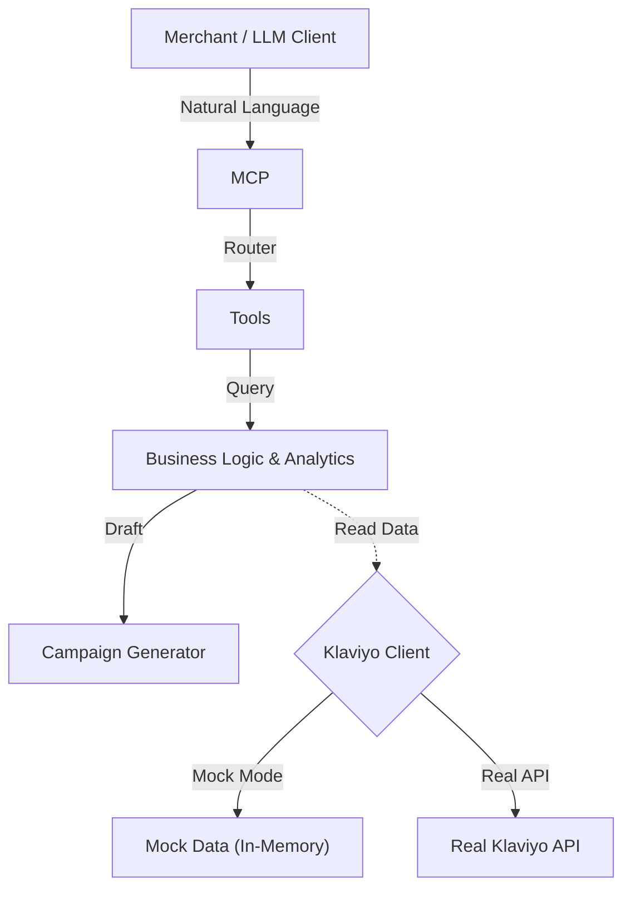

# MCP Personal Shopping Assistant 🛍️
> **A Klaviyo Hackathon Project (Winter 2026)**

## 1. Project Overview
**The Problem:** E-commerce merchants spend hours jumping between analytics dashboards to find customer segments and separate tools to write marketing copy. It’s a disconnected, manual workflow.

**The Solution:** The **MCP Personal Shopping Assistant** is a backend service designed for LLMs. It bridges the gap between *data* and *action*. Instead of clicking through menus, a merchant can simply ask: *"Who are my top paying customers in New York, and can you draft a 'VIP early access' SMS for them?"*

**What It Does:**
*   Queries deep customer insights (LTV, last order date, favorite categories).
*   Summarizes segment behavior instantly.
*   Generates ready-to-send marketing campaign drafts (Email or SMS) tailored to that specific audience.

---

## 2. Why This Matters
*   **For Marketers:** dramatically reduces the "time-to-campaign" by automating the research-to-draft loop.
*   **For Teams:** enables non-technical users to query complex data using natural language.
*   **Impact:** A single conversation can replace SQL queries, dashboard filtering, and copywriting sessions.

---

## 3. How It Works
The project implements the **Model Context Protocol (MCP)**, allowing any MCP-compliant LLM client to "see" and "use" our tools.



### Core Components
*   **MCP Server**: Entry point handling tool requests.
*   **Domain Logic**: Type-safe business rules for calculating LTV and segmenting users.
*   **Draft Engine**: A template-based system that contextualizes marketing copy based on segment data.
*   **Dual-Mode Client**: seamless switching between a rich **Mock Dataset** (for testing/judging) and the real **Klaviyo API**.

---

## 4. Setup Instructions

### Prerequisites
*   Node.js (v18 or higher)
*   npm

### Installation
1.  Clone the repository.
2.  Install dependencies:
    ```bash
    npm install
    ```
3.  Configure environment (Optional):
    ```bash
    # The project runs in Mock Mode by default, so no API key is needed!
    cp .env.example .env
    ```

---

## 5. Configuration & Environment Variables ⚙️

This project uses `dotenv` to manage configuration. By default, it runs in **Mock Mode** using **Ollama**, so **no external API keys are required** to get started.

### Environment Variables Table

| Variable | Required? | Description | Default |
| :--- | :--- | :--- | :--- |
| `USE_MOCK_KLAVIYO` | No | `true` uses in-memory mock data. `false` calls real Klaviyo API. | `true` |
| `KLAVIYO_API_KEY` | No* | Real Klaviyo Private API Key (pk_...). *Required only if `USE_MOCK_KLAVIYO=false`. | - |
| `PORT` | No | Port for the Web UI server. | `3000` |
| `LLM_PROVIDER` | No | Which LLM to use: `ollama`, `openai`, or `http`. | `ollama` |
| `OLLAMA_HOST` | No | URL of your Ollama instance. | `http://localhost:11434` |
| `OLLAMA_MODEL` | No | Model to use with Ollama. | `mistral:7b-instruct` |
| `OPENAI_API_KEY` | No* | OpenAI API Key (sk-...). *Required only if `LLM_PROVIDER=openai`. | - |
| `OPENAI_MODEL` | No | OpenAI Model (e.g. gpt-4o, gpt-3.5-turbo). | `gpt-3.5-turbo` |
| `LLM_API_URL` | No* | Custom endpoint URL. *Required only if `LLM_PROVIDER=http`. | - |

### Example Configurations

You can copy `.env.example` to `.env` and adjust as needed.

#### 1. Default (Mock Data + Local Ollama)
Safe, free, and private. Recommended for testing.
```env
USE_MOCK_KLAVIYO=true
LLM_PROVIDER=ollama
OLLAMA_HOST=http://localhost:11434
OLLAMA_MODEL=mistral:7b-instruct
```

#### 2. OpenAI Mode (Bring Your Own Key)
Uses OpenAI for higher quality reasoning.
```env
USE_MOCK_KLAVIYO=true
LLM_PROVIDER=openai
OPENAI_API_KEY=sk-your-actual-api-key
OPENAI_MODEL=gpt-4o
```
> **⚠️ WARNING:** Never commit your `.env` file containing real API keys!

#### 3. Real Klaviyo Data (Production-like)
Connects to a live Klaviyo account.
```env
USE_MOCK_KLAVIYO=false
KLAVIYO_API_KEY=pk_your_private_key
LLM_PROVIDER=ollama
```

---

## 6. Usage & Demos (How to Test)
I have provided one-command demo scripts so you can verify the functionality immediately without needing an external LLM client setup.

### 🏁 Quick Start: The "VIP Flow"
Run the full end-to-end flow: finding top customers and drafting their campaign.
```bash
npm run demo:top
```
*Output: Lists 3 VIP customers in NY and prints a generated email draft.*

### 📊 Segment Analytics
See how the assistant summarizes data for specific categories (e.g., "outerwear") or lapsed users.
```bash
npm run demo:summary
```

### 📱 SMS Campaign Generation
Test the specific SMS drafting logic for a target group.
```bash
npm run demo:sms
```

### 🛠️ CLI Harness / Custom Testing
Want to poke at the tools directly? Use our CLI harness to pass any JSON input to any tool.
```bash
# Syntax: npm run demo:cli -- <tool_name> <json_input>

# Example: Find top 2 customers in California
npm run demo:cli -- get_top_customers "{\"region\":\"CA\",\"limit\":2}"
```

---

## 6. LLM-Powered Agent Mode 🤖 (Bring Your Own LLM)

**Disclaimer:** This project does **NOT** include access to a hosted model. You must run your own LLM (e.g., Ollama, OpenAI, LF) to use Agent Mode. The project runs in **Mock Mode** by default effectively without an LLM.

This mode allows you to connect to **your local or private LLM** to understand natural language and execute the correct tools automatically.

### Prerequisites for Agent Demo
1.  **Ollama** running locally or on a network server (or another supported provider).
2.  A model installed (e.g., `ollama pull mistral:7b-instruct`).

### Configuration
Update your `.env` file if your Ollama instance is not at `localhost:11434`.
```env
OLLAMA_HOST=http://<your-host-ip>:11434
OLLAMA_MODEL=mistral:7b-instruct
```


### Usage
Ensure your LLM is running, then ask the agent anything in plain English!

```bash
# Find VIPs
npm run demo:agent -- "find top VIP customers in California who haven't ordered in 60 days"

# Analytics
npm run demo:agent -- "summarize outerwear fans in New York who haven't bought recently"

# Creative Drafting
npm run demo:agent -- "draft an email to lapsed VIPs on the west coast with an early access offer"
```

**How it works:**
1.  The TS script sends your query to the private Ollama endpoint.
2.  The LLM (Mistral) decides which tool to call and extracts the parameters as JSON.
3.  The MCP server executes the tool and returns the result.


---

## 6.5 Bring Your Own LLM (Local, Cloud, or Hosted) 🧠
The assistant is designed to be model-agnostic. While it defaults to **Ollama**, you can easily switch to **OpenAI** or any **Generic HTTP** endpoint (LM Studio, LocalAI, vLLM, etc.).

### How to Switch
1.  Open `.env`.
2.  Set `LLM_PROVIDER` to one of: `ollama`, `openai`, or `http`.
3.  Configure the corresponding variables.

#### Option 1: Ollama (Default)
```bash
LLM_PROVIDER=ollama
OLLAMA_HOST=http://localhost:11434
OLLAMA_MODEL=mistral:7b-instruct
```

#### Option 2: OpenAI
```bash
LLM_PROVIDER=openai
OPENAI_API_KEY=sk-...
OPENAI_MODEL=gpt-4o
```
*Note: This will call `https://api.openai.com/v1/chat/completions`.*

#### Option 3: Generic / Local HTTP (LM Studio, etc.)
```bash
LLM_PROVIDER=http
LLM_API_URL=http://localhost:1234/v1/chat/completions
```
*Use this for any provider that accepts an OpenAI-compatible JSON payload.*

### Mechanism
-   The assistant only requires the LLM to return a JSON object: `{ "tool": "...", "input": { ... } }`.
-   Any model capable of following this instruction and outputting JSON will work.
-   MCP tools are unchanged — only the LLM wrapper changes.

---

## 7. Web UI (Optional Front-End Demo) 🖥️
I also provide a modern, local web interface to interact with the assistant visually.

### Setup & Run
1.  Install dependencies (if not already done):
    ```bash
    npm install
    ```
2.  Start the web server:
    ```bash
    npm run web:dev
    ```
3.  Open **[http://localhost:3000](http://localhost:3000)** in your browser.

### Features
-   Clean, internal-tool style interface.
-   Type natural language queries directly.
-   View the **JSON Tool Decision** (what the LLM chose) side-by-side with the **MCP Result**.
-   **Personalization**: If you ask to "personalize" or "draft for each customer", the UI will show individual variants.

---

## 8. Available Tools (API Reference)
The following tools are exposed to the LLM:

| Tool Name | Input | Description |
| :--- | :--- | :--- |
| `get_top_customers` | `{ region?, limit? }` | Returns highest LTV customers, optionally filtered by state. |
| `get_segment_summary` | `{ category?, minDays? }` | Aggregates metrics (count, avg LTV) for a category or filtered list. |
| `create_campaign_draft` | `{ segment, goal, channel }` | Generates potential subject lines and body copy for Email/SMS. |

---

## License
ISC

This project is licensed under the ISC License. See the `LICENSE` file for details.